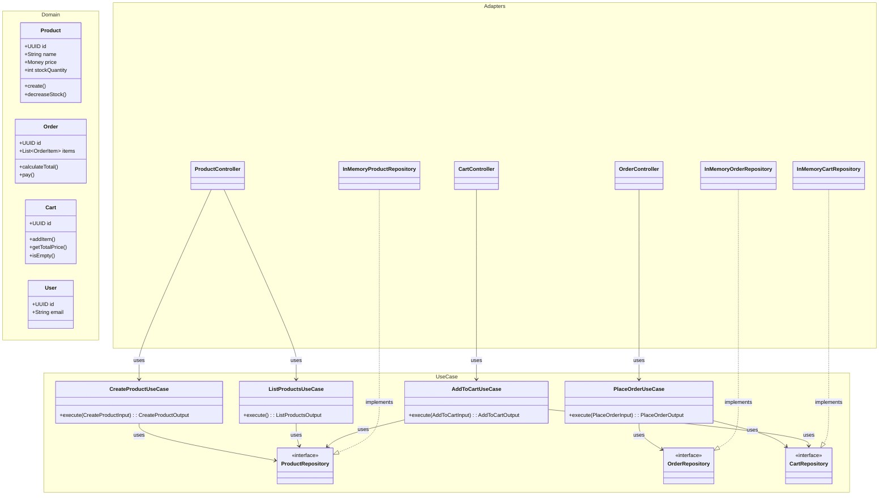

# E-Commerce App (Clean Architecture + Modular Monolith)

This project is a **Modular Monolith** implementation of an E-Commerce system, strictly adhering to **Clean Architecture** principles (Uncle Bob) and **Screaming Architecture**.

## 🏗 Architecture

The system is designed to be independent of frameworks, databases, and external agencies. The core business logic is isolated in the `Domain` and `UseCase` layers.

### Component Diagram


### Dependency Rule
- Source code dependencies **always point inwards**.
- `Domain` knows nothing about `UseCase`.
- `UseCase` knows nothing about `Adapters` (Web/DB).
- `Infrastructure` depends on everything else.

---

## 🛡 Architectural Enforcement & Testing

We use automated tests to prevent architectural erosion ("Big Ball of Mud").

### 1. ArchUnit Tests (`ArchitectureTest.java`)
Runs with every build (`mvn test`) and enforces:
- **Layer Integrity:** Controllers cannot access Repositories directly.
- **No Cycles:** Zero cyclic dependencies allowed between packages.
- **Clean Use Cases:** Use Cases must NOT have framework annotations like `@Transactional`.

### 2. Static Analysis (PMD & Checkstyle)
- **Cyclomatic Complexity:** Enforces low complexity (e.g., `Product` validation logic was refactored to specific methods).
- **Loose Coupling:** Checks for Law of Demeter violations (e.g., `Cart` exposes `isEmpty()` instead of leaking list structure).

### 3. Fitness Functions (`FitnessTest.java`)
- **Performance:** Critical paths must execute under strict time thresholds.
- **Structure:** Prevents "God Classes" and "God Packages".

---

## 🚀 How to Run

### Requirements
- Java 17+
- Maven 3.8+

### Build & Test
```bash
mvn clean test
```

### Generate Architecture Metrics
```bash
mvn jdepend:generate
mvn pmd:pmd
mvn checkstyle:checkstyle
```
