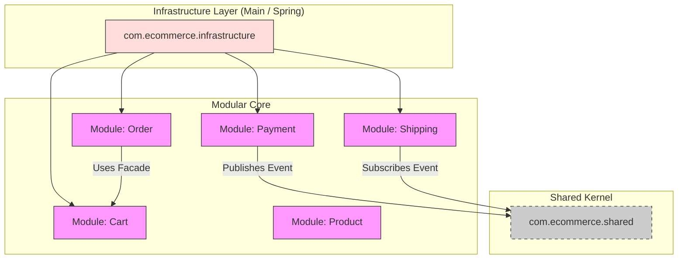

# 🏛️ Clean Architecture E-Commerce (Modular Monolith)


A reference implementation of a **Modular Monolith** e-commerce system, strictly adhering to **Uncle Bob's Clean Architecture** principles. This project demonstrates how to build maintainable, testable, and loosely coupled software without relying on heavy frameworks for domain logic.

---

## 🌟 Key Features & Patterns

*   **Clean Architecture:** Domain logic is independent of frameworks, UI, and Database.
*   **Modular Monolith:** Functionality is split into isolated modules (`Product`, `Cart`, `Order`, etc.) with strict boundaries.
*   **Module Facades:** Modules communicate **ONLY** via Public APIs (Interfaces/DTOs). Internal implementation is completely hidden.
*   **Event-Driven Architecture:** Decoupled integration using Domain Events (e.g., `PaymentSucceededEvent` triggers `Shipping`).
*   **Ports & Adapters (Hexagonal):**
    *   **Driving Adapters (In):** Controllers, Event Handlers.
    *   **Driven Adapters (Out):** Repositories, External Providers.
*   **Strict Encapsulation:** Implementation classes (`...Impl`) are package-private.
*   **ADR (Architecture Decision Records):** All major decisions are documented in `docs/adr`.

---

## 📦 System Modules

| Module | Description | Key Patterns | Public API (Facade) |
| :--- | :--- | :--- | :--- |
| **Product** | Manages product catalog and inventory. | CQRS (Separated Use Cases), Rich Domain Model | `ProductController` (for now) |
| **Cart** | Handles temporary items for users. | **State Pattern** (Discount logic), **Facade** | `CartService`, `CartDto` |
| **Discount** | Applies pricing rules to carts. | **Strategy Pattern** (Percent/Fixed), **Factory** | `DiscountRepository` |
| **Order** | Manages lifecycle of orders. | **Aggregate Root**, **Domain Events** | `PlaceOrderUseCase` |
| **Payment** | Processes payments via gateways. | **Strategy Pattern** (CreditCard/Bank), **Observer** (EventBus) | `PayOrderUseCase` |
| **Shipping** | Handles delivery and tracking. | **Event-Driven**, **Module Factory**, **Strict Encapsulation** | `ShippingService`, `ShipmentDto` |

---

## 🏗️ Architecture Diagrams

### 1. High-Level Component Structure
Each module is a self-contained unit. Low-level details (DB, Web) are plugins to the core.



### 2. Shipping Module Internals (Strict Encapsulation Example)
Dış dünya sadece `api` paketini görür. `internal` paket tamamen gizlidir.

```text
com.ecommerce.shipping
├── api                  <-- PUBLIC (Safe Zone) 🟢
│   ├── ShippingService.java (Interface)
│   └── dto/ShipmentDto.java
├── internal             <-- PACKAGE-PRIVATE (Hidden) 🔒
│   ├── ShippingServiceImpl.java
│   └── ShippingModule.java (Factory)
├── usecase              <-- CORE LOGIC
│   ├── CreateShipmentUseCase.java
│   └── TrackShipmentUseCase.java
└── adapter              <-- ADAPTERS
    ├── in/event/OrderPaidEventHandler.java (Listener)
    └── out/persistence/InMemoryShipmentRepository.java
```

---

## 🛠️ How to Run

This project is a pure Java application (simulating a DI container in `Main.java`).

### Prerequisites
*   Java 17+
*   Maven 3.8+

### Build & Run
```bash
# Compile and Run the Console Application
mvn clean compile
mvn org.codehaus.mojo:exec-maven-plugin:java -Dexec.mainClass=com.ecommerce.infrastructure.Main
```

### Sample Output
```text
--- E-Commerce System Started ---
[1] Creating Product...
[2] Listing Products...
[3] Adding to Cart...
[4] Applying Discount...
[5] Placing Order... (Order Placed: ID=...)
[6] Paying Order...
[Event] Order ... status updated to PAID.
[Shipping] Payment event received...
[Shipping] Shipment created: ...
[7] Tracking Shipment...
Shipment Tracking: ... [PREPARING] to ...
```

---

## 📜 Architecture Decision Records (ADRs)

We document importance decisions in `docs/adr`:

*   [ADR 0001: Monolithic Structure](docs/adr/0001-record-architecture-decisions.md)
*   [ADR 0010: Module Facades](docs/adr/0010-module-facade.md)
*   [ADR 0011: Strict Module Encapsulation](docs/adr/0011-package-by-component.md)
*   [ADR 0012: Shipping Module Design](docs/adr/0012-shipping-module-design.md)
*   [ADR 0013: Adaptation Layer Strictness](docs/adr/0013-strict-module-encapsulation.md)

---

## 🧪 Quality Gates & Testing

We enforce architecture rules using **ArchUnit** and **Static Analysis**.

```bash
# Run Architecture Tests
mvn test

# Generate Quality Metrics
mvn pmd:pmd
mvn checkstyle:checkstyle
```

---

**Built with ☕ and Clean Code principles.**
