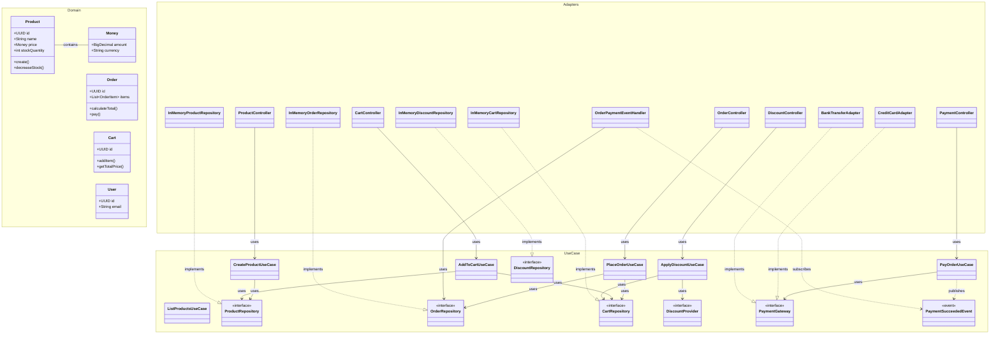

# Clean Architecture E-Commerce System 🛍️🚀

A robust, production-ready E-Commerce backend built with Java 17, demonstrating strict adherence to **Robert C. Martin's Clean Architecture** principles, SOLID design, and **Site Reliability Engineering (SRE)** patterns.

## 🏛️ Architectural Philosophy

This project aims to completely isolate **Enterprise Business Rules (Entities)** and **Application Business Rules (Use Cases)** from external technical details (Databases, Web Frameworks, APIs).

*   **The Dependency Rule:** Source code dependencies *only* point inward. Inner layers know absolutely nothing about outer layers.
*   **Decoupled Modules:** `Product`, `Order`, `Cart`, `Discount`, and `Payment` are strictly encapsulated. They communicate via DTOs, Event-Driven Architecture (Pub/Sub EventBus), and Facade Services, rather than direct entity manipulation.
*   **Deferred Decisions:** The system runs completely in-memory, deferring the choice of a specific database or web framework (like Spring Boot) until necessary.

### Conceptual Component Architecture


```mermaid
classDiagram
    %% --- DOMAIN LAYER (Enterprise Business Rules) ---
    namespace Domain {
      class Product {
        +UUID id
        +String name
        +Money price
        +int stockQuantity
        +create()
        +decreaseStock()
      }
      class Order {
        +UUID id
        +List~OrderItem~ items
        +calculateTotal()
        +pay()
      }
      class Cart {
        +UUID id
        +addItem()
        +getTotalPrice()
      }
      class User {
        +UUID id
        +String email
      }
      class Money {
        +BigDecimal amount
        +String currency
      }
    }
    Product -- Money : contains

    %% --- USE CASE LAYER (Application Business Rules) ---
    namespace UseCase {
      class CreateProductUseCase
      class PlaceOrderUseCase
      class AddToCartUseCase
      class ListProductsUseCase
      class ApplyDiscountUseCase
      class PayOrderUseCase
      
      %% Input/Output Ports (Interfaces)
      class ProductRepository { <<interface>> }
      class OrderRepository { <<interface>> }
      class CartRepository { <<interface>> }
      class DiscountRepository { <<interface>> }
      class DiscountProvider { <<interface>> }
      class PaymentGateway { <<interface>> }
      
      %% Events
      class PaymentSucceededEvent { <<event>> }
    }

    CreateProductUseCase --> ProductRepository : uses
    PlaceOrderUseCase --> OrderRepository : uses
    PlaceOrderUseCase --> CartRepository : uses
    AddToCartUseCase --> CartRepository : uses
    AddToCartUseCase --> ProductRepository : uses
    ApplyDiscountUseCase --> CartRepository : uses
    ApplyDiscountUseCase --> DiscountProvider : uses
    PayOrderUseCase --> PaymentGateway : uses
    PayOrderUseCase ..> PaymentSucceededEvent : publishes

    %% --- INTERFACE ADAPTERS LAYER ---
    namespace Adapters {
      class ProductController
      class OrderController
      class CartController
      class DiscountController
      class PaymentController
      class InMemoryProductRepository
      class InMemoryOrderRepository
      class InMemoryCartRepository
      class InMemoryDiscountRepository
      class CreditCardAdapter
      class BankTransferAdapter
      class OrderPaymentEventHandler
    }

    %% RELATIONSHIPS
    ProductController --> CreateProductUseCase : uses
    OrderController --> PlaceOrderUseCase : uses
    CartController --> AddToCartUseCase : uses
    DiscountController --> ApplyDiscountUseCase : uses
    PaymentController --> PayOrderUseCase : uses
    OrderPaymentEventHandler ..> PaymentSucceededEvent : subscribes
    OrderPaymentEventHandler --> OrderRepository : uses

    InMemoryProductRepository ..|> ProductRepository : implements
    InMemoryOrderRepository ..|> OrderRepository : implements
    InMemoryCartRepository ..|> CartRepository : implements
    InMemoryDiscountRepository ..|> DiscountRepository : implements
    CreditCardAdapter ..|> PaymentGateway : implements
    BankTransferAdapter ..|> PaymentGateway : implements
```

---

## 🛡️ SRE & Production Readiness (Release It!)

The platform goes beyond architecture to guarantee extreme stability and fault-tolerance in chaotic production environments. We applied Michael Nygard's architecture layers to complement Clean Architecture:

### 1. Foundation (Infrastructure & Environment)
*The bare metal or containerized environment that physically bounds the application.*
*   **Container Security & Sizing:** Included a **Multi-Stage Dockerfile** relying on `eclipse-temurin:17-jre-alpine`. It restricts file permissions, strips tooling, and runs exclusively as `ecommerceuser` (non-root).
*   **12-Factor App Config:** Ports and pool configurations are externalized through `.env` (`dotenv-java`), completely removing hard-coded properties.
*   **Telemetry:** Console messages are disabled in favor of asynchronous **JSON Logging (`SLF4J` + `Logback`)** targeting stdout, ready for robust ELK/Datadog scraping.
*   **Physical Bulkheads (Kubernetes):** Enforced `limits` and `requests` mapping to prevent unbounded CPU (`500m`) and Memory (`512Mi`) spikes across cluster nodes in `k8s/deployment.yaml`.

### 2. Interconnect (Integration Points)
*The communication lines handling external APIs, databases, and message buses where cascading failures typically originate.*
*   All outbound network boundaries (Adapters mapping to APIs like Bank and Cargo) are heavily guarded using **Resilience4j Armor**:
    *   **Timeouts (`TimeLimiter`):** Prevents blocking threads against slow third-party responses.
    *   **Circuit Breakers:** Detects consecutive failures and halts outgoing traffic instantly.
    *   **Logical Bulkheads:** Limits concurrent traffic executing on external Adapters protecting our native Thread Pools.
    *   **Retries:** Exponential backoffs implemented for intermittent network errors.
*   **EventBus:** Asynchronous internal service communication (e.g., Shipping reacting to Payments) is detached using a Pub/Sub mechanism to avoid blocking the main thread.

### 3. Control Plane (Governance & Health)
*The management layer that observers and steers the instances, typically interacting with Kubernetes or Load Balancers.*
*   Exposes a custom Java-native `HealthServer` resolving basic `/health/liveness` (reporting process validity) and `/health/readiness` (reporting traffic capacity) endpoints.
*   **Disposability & Graceful Shutdown**: JVM handles `SIGTERM` gracefully: pauses Health endpoints (switching readiness to `false`), grants a 3-second grace period for inflight executions to wrap up, and then safely shuts down.

### 4. Instances (Application Workloads)
*The scaled replicas executing the core domain rules.*
*   **Clean Architecture Rules**: The `com.ecommerce.domain` and `usecase` layers remain purely synchronous, testable, and completely detached from the infrastructure chaos.
*   **Stateless Replication**: Kubernetes `deployment.yaml` specifies `replicas: 2`, allowing horizontal scaling and seamless self-healing since the application instances maintain no local state.
    
---

## 🛠️ Architecture Enforcement Checks

The application is heavily guarded against "architectural drift" using unit tests, byte-code analysis, and static metrics:

*   **ArchUnit**: Detects cycle dependencies between modules and ensures inner rings never import frameworks or adapter packages.
*   **PMD & Checkstyle**: Analyzes complex NPath values, Cyclomatic complexities, and ensures strict Google Java Formatting styles.
*   **Fitness Functions**: Tests generic scenario lifecycles (order creation timeframes) to prove SLA thresholds.

### Running Enforcement Metrics

```bash
# Evaluate CheckStyle & PMD Rules
mvn clean checkstyle:check pmd:check

# Generate JDepend Architecture Dependency Metrics Table in targets
mvn jdepend:generate
```

---

## 📦 Quickstart

### Without Docker (Maven CLI)

1. Make sure Java 17+ and Maven 3.8+ are installed.
2. Clone this repo.
3. Establish Environment Configuration file:
    ```bash
    cp .env.example .env
    # Modify port allocations if needed
    ```
4. Build and run:
    ```bash
    mvn clean package
    mvn exec:java
    ```

### With Docker / Kubernetes

```bash
# Build the Alpine image
docker build -t ecommerce-app:latest .

# Run locally in Docker mapping standard 8080 port
docker run -p 8080:8080 --env-file .env ecommerce-app:latest

# Or apply straight to a local minikube/kind Kubernetes cluster
kubectl apply -f k8s/deployment.yaml
```

The server automatically starts standard operational scenarios resolving domain-level cart handling, promotions, asynchronous events processing, payment fallbacks logging, and shipment tracking sequentially. Check Terminal output to view structured JSON interactions.
