# System Class Diagram

This diagram represents the detailed static structure of the system, including all packages, classes, fields, methods, and relationships. It reflects strict module encapsulation (API vs Internal) and Payment decoupling.

```mermaid
classDiagram
    %% --- Shared Kernel ---
    namespace com_ecommerce_shared_domain {
        class Money {
            -BigDecimal amount
            -String currency
            +add(Money) Money
            +subtract(Money) Money
            +multiply(double) Money
            +compareTo(Money) int
        }
    }
    
    namespace com_ecommerce_shared_event {
        class DomainEvent {
            <<interface>>
            +occurredOn() LocalDateTime
        }
        class EventBus {
            <<interface>>
            +publish(DomainEvent)
            +subscribe(Class, Consumer)
        }
        class SimpleEventBus {
            -Map subscribers
            +publish(DomainEvent)
            +subscribe(Class, Consumer)
        }
    }
    
    SimpleEventBus ..|> EventBus
    
    %% --- Product Module ---
    namespace com_ecommerce_product {
        class Product {
            -UUID id
            -String name
            -String description
            -Money price
            -int stock
            +updateStock(int)
        }
        class ProductRepository {
            <<interface>>
            +save(Product)
            +findById(UUID) Optional~Product~
            +findAll() List~Product~
        }
        class CreateProductUseCase {
            -ProductRepository repository
            +execute(CreateProductInput) CreateProductOutput
        }
        class ListProductsUseCase {
            -ProductRepository repository
            +execute() ListProductsOutput
        }
    }
    
    CreateProductUseCase --> ProductRepository
    ListProductsUseCase --> ProductRepository
    ProductRepository ..> Product
    
    namespace com_ecommerce_product_adapter {
        class InMemoryProductRepository {
            -Map store
            +save(Product)
            +findById(UUID)
            +findAll()
        }
        class ProductController {
            -CreateProductUseCase createUC
            -ListProductsUseCase listUC
            +createProduct(CreateProductInput)
            +listProducts()
        }
    }

    InMemoryProductRepository ..|> ProductRepository
    ProductController --> CreateProductUseCase
    ProductController --> ListProductsUseCase

    %% --- Cart Module ---
    namespace com_ecommerce_cart {
        class Cart {
            -UUID id
            -UUID userId
            -List~CartItem~ items
            -Money discount
            +addItem(UUID, int, Money)
            +applyDiscount(Money)
            +getTotalPrice() Money
            +clear()
        }
        class CartItem {
            -UUID productId
            -int quantity
            -Money price
            +increaseQuantity(int)
            +getSubTotal() Money
            +getTotalPrice() Money
            +getUnitPrice() Money
        }
        class CartRepository {
            <<interface>>
            +save(Cart)
            +findByUserId(UUID) Optional~Cart~
            +findDtoByUserId(UUID) Optional~CartDto~
        }
        class DiscountProvider {
            <<interface>>
            +getDiscount(Cart, String) Optional~Money~
        }
        class AddToCartUseCase {
            -CartRepository cartRepo
            -ProductRepository productRepo
            +execute(AddToCartInput) AddToCartOutput
        }
        class ApplyDiscountUseCase {
            -CartRepository cartRepo
            -DiscountProvider discountProvider
            +execute(ApplyDiscountInput)
        }
    }

    namespace com_ecommerce_cart_api {
        class CartService {
            <<interface>>
            +getCartForOrder(UUID) Optional~CartDto~
            +clearCart(UUID)
        }
    }

    namespace com_ecommerce_cart_internal {
        class CartServiceImpl {
            -CartRepository cartRepository
            ~CartServiceImpl(CartRepository)
            +getCartForOrder(UUID)
            +clearCart(UUID)
        }
        class CartModule {
            +createService(CartRepository) CartService
        }
    }

    namespace com_ecommerce_cart_dto {
        class CartDto {
            <<record>>
            +UUID userId
            +List~CartItemDto~ items
            +Money discount
            +Money totalAmount
        }
        class CartItemDto {
            <<record>>
            +UUID productId
            +int quantity
            +Money unitPrice
            +Money totalPrice
        }
        class CartMapper {
            +toDto(Cart) CartDto
        }
    }

    Cart *-- CartItem
    AddToCartUseCase --> CartRepository
    ApplyDiscountUseCase --> CartRepository
    ApplyDiscountUseCase --> DiscountProvider
    CartRepository ..> Cart
    CartRepository ..> CartDto
    CartMapper ..> Cart
    CartMapper ..> CartDto
    
    CartServiceImpl ..|> CartService
    CartServiceImpl --> CartRepository
    CartModule ..> CartServiceImpl : creates
    CartModule ..> CartService : returns

    namespace com_ecommerce_cart_adapter {
        class InMemoryCartRepository {
            -Map carts
            -Map userCartMap
            +save(Cart)
            +findByUserId(UUID)
            +findDtoByUserId(UUID)
        }
        class CartController {
            -AddToCartUseCase addUC
            -ApplyDiscountUseCase applyDiscountUC
            +addToCart(AddToCartInput)
            +applyDiscount(ApplyDiscountInput)
        }
    }

    InMemoryCartRepository ..|> CartRepository
    CartController --> AddToCartUseCase
    CartController --> ApplyDiscountUseCase

    %% --- Discount Module ---
    namespace com_ecommerce_discount {
        class Discount {
            -UUID id
            -String code
            -Money amount
            +isValid() boolean
        }
        class DiscountRepository {
            <<interface>>
            +save(Discount)
            +findByCode(String) Optional~Discount~
        }
        class GetDiscountUseCase {
            -DiscountRepository repository
            +execute(GetDiscountInput) GetDiscountOutput
        }
    }
    
    GetDiscountUseCase --> DiscountRepository
    DiscountRepository ..> Discount

    namespace com_ecommerce_discount_adapter {
        class InMemoryDiscountRepository {
            -Map store
            +save(Discount)
            +findByCode(String)
        }
    }

    InMemoryDiscountRepository ..|> DiscountRepository

    %% --- Order Module ---
    namespace com_ecommerce_order {
        class Order {
            -UUID id
            -UUID userId
            -Status status
            -List~OrderItem~ items
            -Money discount
            -Money totalAmount
            +pay()
            +markAsPaid()
        }
        class OrderItem {
            -UUID productId
            -int quantity
            -Money unitPrice
        }
        class OrderRepository {
            <<interface>>
            +save(Order)
            +findById(UUID) Optional~Order~
        }
        class PlaceOrderUseCase {
            -OrderRepository orderRepo
            -CartService cartService
            +execute(PlaceOrderInput) PlaceOrderOutput
        }
    }
    
    Order *-- OrderItem
    PlaceOrderUseCase --> OrderRepository
    PlaceOrderUseCase --> CartService
    OrderRepository ..> Order

    namespace com_ecommerce_order_adapter {
        class InMemoryOrderRepository {
            -Map store
            +save(Order)
            +findById(UUID)
        }
        class OrderController {
            -PlaceOrderUseCase placeOrderUC
            +placeOrder(PlaceOrderInput)
        }
        class OrderPaymentEventHandler {
            -OrderRepository orderRepo
            +handlePaymentSuccess(PaymentSucceededEvent)
        }
    }

    InMemoryOrderRepository ..|> OrderRepository
    OrderController --> PlaceOrderUseCase
    OrderPaymentEventHandler --> OrderRepository
    OrderPaymentEventHandler ..> EventBus : subscribes

    %% --- Payment Module ---
    namespace com_ecommerce_payment {
        class PaymentGateway {
            <<interface>>
            +pay(Money) boolean
        }
        class PayOrderUseCase {
            -Map~String,PaymentGateway~ strategies
            -EventBus eventBus
            +execute(PayOrderInput) PayOrderOutput
        }
        class PayOrderInput {
            <<record>>
            +UUID orderId
            +Money amount
            +String paymentMethod
        }
        class PaymentSucceededEvent {
            <<record>>
            +UUID orderId
            +Money amount
        }
    }

    PayOrderUseCase --> PaymentGateway
    PayOrderUseCase ..> EventBus : publishes
    PayOrderUseCase ..> PayOrderInput
    PaymentSucceededEvent --|> DomainEvent

    namespace com_ecommerce_payment_adapter {
        class CreditCardAdapter {
            +pay(Money) boolean
        }
        class BankTransferAdapter {
            +pay(Money) boolean
        }
        class PaymentController {
            -PayOrderUseCase payOrderUC
            +payOrder(PayOrderInput)
        }
    }

    CreditCardAdapter ..|> PaymentGateway
    BankTransferAdapter ..|> PaymentGateway
    PaymentController --> PayOrderUseCase

    %% --- Infrastructure / Wiring ---
    class Main {
        +main(String[])
    }
    
    Main --> ProductController
    Main --> CartController
    Main --> OrderController
    Main --> PaymentController
    Main --> EventBus
    Main --> OrderPaymentEventHandler
    Main --> CartModule
```

