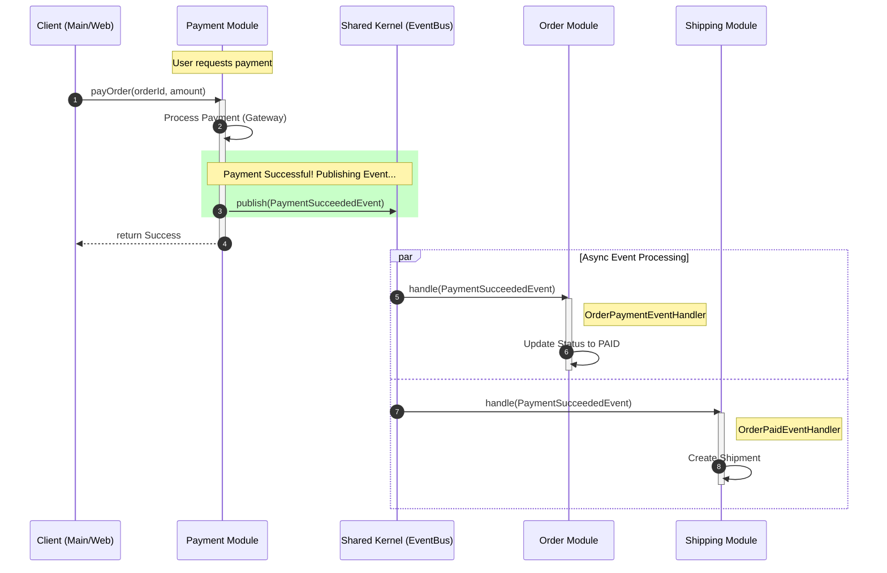

# Payment Event Flow Diagram

This diagram illustrates how the `Payment` module communicates with `Order` and `Shipping` modules via the `Shared Kernel` (EventBus) after a successful payment.

## Explanation
1.  **Payment Module:** Does its job (processing payment) and knows nothing about Order or Shipping logic. It just shouts "Payment Succeeded!" via `EventBus`.
2.  **Shared Kernel (EventBus):** Acts as the mediator. It doesn't know business logic, just routes messages to subscribers.
3.  **Order Module:** Subscribes to the event to update its own state (PAID).
4.  **Shipping Module:** Subscribes to the event to start its own process (Create Shipment).

This is **Decoupled Architecture**. If we remove the `Shipping` module, the `Payment` module continues to work without errors.
