# System Architecture Overview

This document provides a high-level visualization of the E-Commerce System's **Modular Monolith** architecture.
It follows the **Clean Architecture** principles, enforcing strict separation of concerns and dependency rules.

## High-Level Component Diagram (Mermaid)

The following diagram illustrates the 5 main Bounded Contexts and their interactions via Ports & Adapters.

```mermaid
graph TD
    %% --- STYLES ---
    classDef domain fill:#f9f,stroke:#333,stroke-width:2px,color:black
    classDef usecase fill:#bbf,stroke:#333,stroke-width:2px,color:black
    classDef infra fill:#ddd,stroke:#333,stroke-width:2px,color:black
    classDef port fill:#fff,stroke:#333,stroke-width:2px,stroke-dasharray: 5 5,color:black

    %% --- BOUNDED CONTEXT: PRODUCT ---
    subgraph ProductContext [Product Module]
        direction TB
        P_Entity(Product Entity):::domain
        P_Repo_Port(ProductRepository <br/> Interface):::port
        P_UC_Create(CreateProductUseCase):::usecase
        P_UC_List(ListProductsUseCase):::usecase
        
        P_UC_Create --> P_Entity
        P_UC_Create --> P_Repo_Port
        P_UC_List --> P_Repo_Port
    end

    %% --- BOUNDED CONTEXT: CART ---
    subgraph CartContext [Cart Module]
        direction TB
        C_Entity(Cart Entity):::domain
        C_Repo_Port(CartRepository <br/> Interface):::port
        C_Disc_Port(DiscountProvider <br/> Interface):::port
        C_UC_Add(AddToCartUseCase):::usecase
        C_UC_Apply(ApplyDiscountUseCase):::usecase
        
        C_UC_Add --> C_Entity
        C_UC_Add --> C_Repo_Port
        C_UC_Apply --> C_Entity
        C_UC_Apply --> C_Repo_Port
        C_UC_Apply --> C_Disc_Port
    end

    %% --- BOUNDED CONTEXT: DISCOUNT ---
    subgraph DiscountContext [Discount Module]
        direction TB
        D_Entity(Discount Entity):::domain
        D_Repo_Port(DiscountRepository <br/> Interface):::port
        D_UC_Get(GetDiscountUseCase):::usecase
        
        D_UC_Get --> D_Entity
        D_UC_Get --> D_Repo_Port
    end

    %% --- BOUNDED CONTEXT: ORDER ---
    subgraph OrderContext [Order Module]
        direction TB
        O_Entity(Order Entity):::domain
        O_Repo_Port(OrderRepository <br/> Interface):::port
        O_UC_Place(PlaceOrderUseCase):::usecase
        
        O_UC_Place --> O_Entity
        O_UC_Place --> O_Repo_Port
    end
    
    %% --- BOUNDED CONTEXT: PAYMENT ---
    subgraph PaymentContext [Payment Module]
        direction TB
        Pay_Repo_Port(PaymentGateway <br/> Interface):::port
        Pay_UC_Process(PayOrderUseCase):::usecase
        
        Pay_UC_Process --> Pay_Repo_Port
    end

    %% --- INFRASTRUCTURE (ADAPTERS) ---
    subgraph Infrastructure [Infrastructure & Adapters]
        direction TB
        P_Repo_Impl(InMemoryProductRepository):::infra
        C_Repo_Impl(InMemoryCartRepository):::infra
        D_Repo_Impl(InMemoryDiscountRepository):::infra
        O_Repo_Impl(InMemoryOrderRepository):::infra
        Pay_Strat_CC(CreditCardAdapter):::infra
        Pay_Strat_Bank(BankTransferAdapter):::infra
        
        Main_Wiring(Main.java / Dependency Injection):::infra
    end

    %% --- RELATIONSHIPS (Wiring & Implementation) ---
    
    %% Implementations (Corrected Syntax is -.->)
    P_Repo_Impl -.-> P_Repo_Port
    C_Repo_Impl -.-> C_Repo_Port
    D_Repo_Impl -.-> D_Repo_Port
    O_Repo_Impl -.-> O_Repo_Port
    Pay_Strat_CC -.-> Pay_Repo_Port
    Pay_Strat_Bank -.-> Pay_Repo_Port

    %% Cross-Module Communication
    Main_Wiring --> |Wires| C_Disc_Port
    Main_Wiring --> |Wires| D_UC_Get
    
    %% Cart connects to Discount via Main Wiring
    C_Disc_Port -.-> |Call via Main| D_UC_Get
    
    %% Order connects to Cart via UseCase
    O_UC_Place --> |Uses| C_Entity
    O_UC_Place --> |Uses| C_Repo_Port
    
    %% Payment connects to Order via Repository
    Pay_UC_Process --> |Updates Status| O_Repo_Port
```

## Layer Description

1.  **Domain Layer (Pink):** The heart of the software. Contains `Entities` (`Cart`, `Product`, `Order`) and Business Logic. Independent of everything.
2.  **Use Case Layer (Blue):** Application specific business rules. Orchestrates the flow of data to and from the entities.
3.  **Ports (Dashed White):** Interfaces that define how the Use Case layer communicates with the outside world (Repositories, Gateways).
4.  **Infrastructure Layer (Grey):** Concrete implementations (In-Memory DBs, Payment Adapters, Main class). This is where the "Dirty Details" live.
